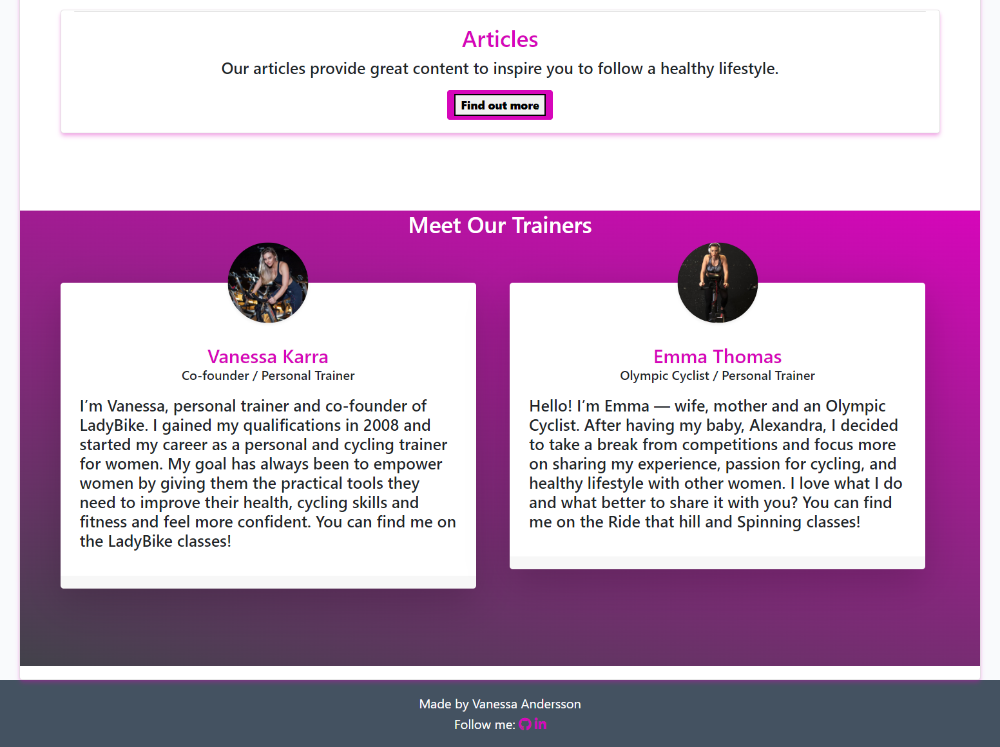
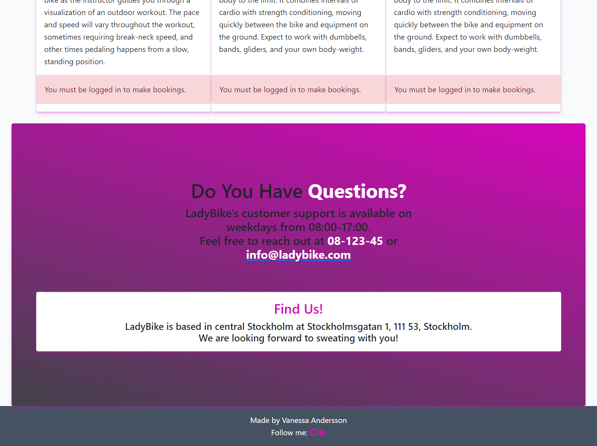
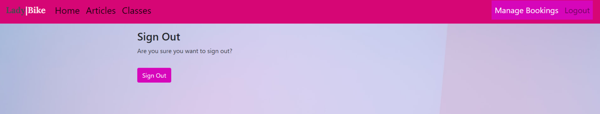
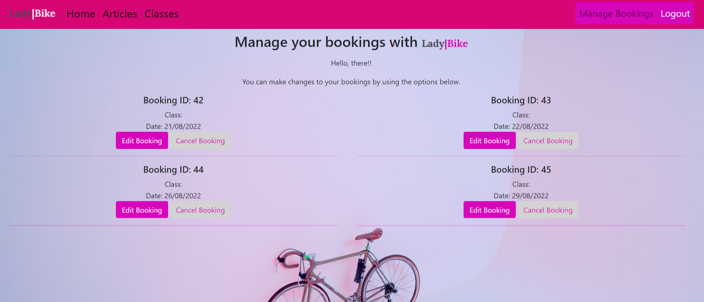
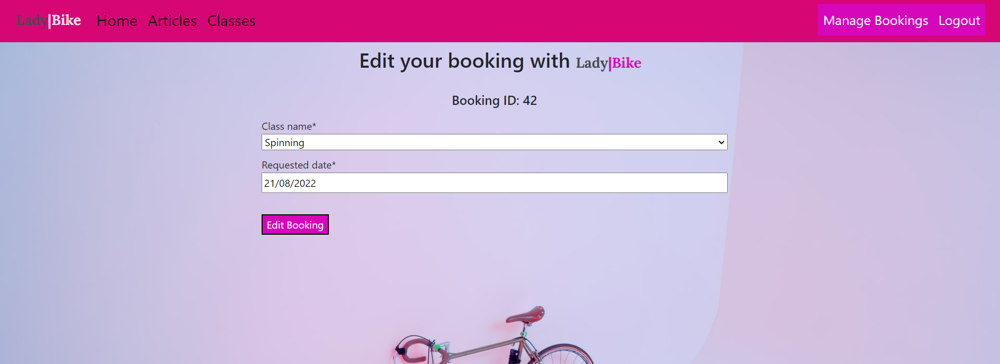

## UX

LadyBike is a cycling booking platform only for women. It provides three biking classes, and articles focused on a healthy lifestyle and cycling tips. It is designed in light and dark-coloured style, using fuchsia and dark light grey colours. The user is given plenty of choices on how to get to the booking form from the home page - via the navbar and a call to action button.

Users can log in with their credentials to make a booking and like the articles. 

###Strategy
Using the core UX principles in design thinking a pesona profile was created by using Code Institutes template and you can find it [HERE](README_docs/UX/Design_Thinking_Persona_template_Project4_Ladybike.pdf)

This website will offer all of these things listed in the Persona template whilst also allowing for intuitive navigation and comfortability of use.

Due to the age group of female users, it is assumed that most users will be viewing the site on their mobile phones; therefore, creating something responsive is integral to the design. Thus, Bootstrap grids and elements & custom CSS have been used to allow this.

## Purpose

The app is designed as a booking application that encourages the users to make a booking.

## User Stories

### User Stories that have been satisfied by creation of particular apps in ths project:

| id  |  content | how was it satisfied
| ------ | ------ | ------ |
|  [#1](https://github.com/van-essa/ladybike/issues/1) | As a user, I can read the page so that I can get more information about Ladybike and the team. | Webpage |
|  [#2](https://github.com/van-essa/ladybike/issues/2) | As a user, I can click on the navbar so that I land on the page I am interested in. | Webpage |
|  [#3](https://github.com/van-essa/ladybike/issues/3) | As a user, I can read more about the classes so that I can book the ones I like the most. | Cycling Classes |
|  [#4](https://github.com/van-essa/ladybike/issues/4) | As a user, I can choose the date of booking so that I can book the cycling class on the date I want. | Booking |
|  [#5](https://github.com/van-essa/ladybike/issues/5) | As a user, I can check the start time of the class so that I can organize my schedule accordingly. |Cycling Classes |
|  [#6](https://github.com/van-essa/ladybike/issues/6) | As a user, I can check the availability of the class so that I know if it is fully-booked. | Booking |
|  [#7](https://github.com/van-essa/ladybike/issues/7) | As a user, I can cancel my booking so that I can join the class when I will be available. | Booking |
|  [#9](https://github.com/van-essa/ladybike/issues/9) | As a user, I can read the articles so that I can learn more about training tips, and healthy recipes. | Articles |
|  [#11](https://github.com/van-essa/ladybike/issues/11) | As a user, I can like the article so that I can can show my appreciation. |  Articles |
|  [#12](https://github.com/van-essa/ladybike/issues/12) | As a user, I can fill in my information so that I can get access to the bookings and like the articles. |  User |
|  [#13](https://github.com/van-essa/ladybike/issues/13) | As an admin, I can manage the articles so that I can share them on my webpage. |  Admin |
|  [#14](https://github.com/van-essa/ladybike/issues/14) | As an admin, I can create drafts so that I can work on the articles later on when I have the time. | Admin |
|  [#21](https://github.com/van-essa/ladybike/issues/21) | As an admin, I can manage the booking on the backend so that I can approve the bookings. |  Admin |
|  [#22](https://github.com/van-essa/ladybike/issues/22) | As a user, I can edit my booking so that I can join the class when I will be available. | Booking |
|  [#23](https://github.com/van-essa/ladybike/issues/23) | As a user, I can create a booking so that I can book a class. | Booking |

### User stories that are planned for next sprint

| id  |  content | 
| ------ | ------ |
|  [#20](https://github.com/van-essa/ladybike/issues/20) | As a user, I can login with my social accounts so that I can get a smoother user experience. |
|  [#19](https://github.com/van-essa/ladybike/issues/19) | AAs a user, I can share the articles on my Social Media accounts so that I can share it on my accounts. |
|  [#18](https://github.com/van-essa/ladybike/issues/18) | As a user, I can comment on the articles so I can share my thoughts. |
|  [#17](https://github.com/van-essa/ladybike/issues/17) | As a user, I can contact LadyBike via a contact form so that I can ask my questions. |
|  [#16](https://github.com/van-essa/ladybike/issues/16) | As a user, I can choose different timeslots so that I can book the class according to my availability. |
|  [#15](https://github.com/van-essa/ladybike/issues/15) | As a user, I can choose more than three biking classes so that I can have more class options. |
|  [#8](https://github.com/van-essa/ladybike/issues/8) | As a user, I can add the class to my calendar so that I can can have it in my schedule. |
|  [#10](https://github.com/van-essa/ladybike/issues/10) | As a user, I can choose the order of the published date so that I can read the latest or oldest article. |

## Agile Methodology

### Canban board and issues

Github issues were used to create the User stories and group them according to MoSCoW prioritization technique. Link to the project with live issues can be found [HERE](https://github.com/van-essa/ladybike/projects/1). The issues are currently in two categories - done or for the next release.

## Scope
In order to achieve the desired user & business goals, the following features will be included in this release:

- Responsive navbar that will navigate to the various pages throughout the site
- Landing page with brief information about the cycling platform and links to the booking page
-Articles page, with cycling, healthy food and lifestyle content
-Article detail page, where logged-in users can like the article
- Classes page, with links to booking
- Booking page, with a booking form to enquire with the cycling gym
- Manage booking page, where logged-in users can edit/delete existing bookings they have
- Register/login feature using Django allauth

## Structure
This website has been designed with simplicity in mind, and each page only has vital information so the user can find what they want quickly without having to read through unnecessary things. Each key feature has been separated to highlight its functionality to the user.

The website is made of three apps:

1. Website - Core functionality
2. Articles - Articles display
3. Booking - Booking enquiries

### Databases

The articles and booking app required databases to store information, so four custom models have been created.

#### Articles
Post is the model name for the Articles app, a standalone model that provide all of the information required to display the article's content as part of the cycling platform. Each article has a title, slug, author, featured image, excerpt, date, content and likes.

#### Booking
There are three models in this app, Customer, ClassName & Booking. Combining these three models allows for customer details to be stored, booking enquiries to be made & managed & also enables availability checks whilst the user is enquiring. 

For each booking, there will be a customer & class name assigned to it. They are assigned during the enquiry process. This works for users that are logged in. Logged-in users will have their details associated with the user email address as this is how they are located in the customer model.

The classes model is also used to determine the classes' availability. This logic prevents bookings from being made if no classes are available at the specified date and time.

Entity Relationship Diagram below to see how the models relate to each other:

### Skeleton
[Wireframes can be viewed here](README_docs/Wireframes/LadyBike_Wireframes.pdf)

Please note that the actual website differs slightly from the original wireframes. 

The theme of simplicity follows through to the design, where bootstrap columns and rows have been used. The aim was to divide the pages to keep the same layout throughout so the user could feel more easily on the various pages.

### Surface
The colour palette chosen for this website was fuchsia, grey and white. The colour palette aimed to create a playful and firm feel. Based on fuchsia colours, LadyBike kept the feeling of a robust virtual environment, while white kept the minimal and clean design. An essential mix to share is that this is a female cycling platform. Grey colour also comes in to break the monotony of only the two colours. 

The fonts chosen for this project are 'Lora' & 'SansSerif', beautifully clean and clear fonts for the headings and the available content as it is easier to read for the user. When LadyBike was referred to, `brand-text` was used for most instances.

---

## Features

### Home page
**Navigation bar**: The navigation bar has links to all the active pages for the user and is clearly labelled, the classes option has its page called Our Classes providing information for each of them, and a link to take the user to the Booking system. The Articles are also included in the navbar, where the user can look at the content and read in detail the article they want.

If the user is logged in, then the right side of the menu shows links for pages that only authorised users can visit & use; they are: 'Manage Reservations' & 'Logout'. Otherwise, the user will be given the option to 'Register' or 'Login'. This change in the menu ensures users are directed to pages they can use, preventing any frustration and prompting them to sign up for an account. Furthermore, it makes it abundantly clear what the logged-in status is to the user.

The navigation bar is fully responsive and collapses on mobile screens to a hamburger icon, this easily allows the user to continue to use the navigation links without the need to press back on the browser. 

**Home**: The user gets the information on the home page to understand that this is a cycling booking platform only for women. Then the trainers' profile is followed to provide a professional background. The front page aims to create a welcoming atmosphere for the user and a clear message to the target audience. Also a link to book a class is provided on the header of the page.

**Footer**: The footer displays the name of the project creator and her social links.

### Articles
**Articles**: The user can look at six articles per page and click on the one they want to read. If the user is logged in, they can like the article.

### Classes
**Our Classes**: On the 'Our Classes' page, the user can learn more about each class and click on the call to action 'Book' to link to the booking system and book the class they want.

The user can also look at Ladybike's address and contact info for customer support.

### Booking
**Booking form**: This page consists of the customer & booking model forms; they are displayed together to appear as one to make it simple for the user.

In order to make a booking, the user must either register or log in.

Alos, noteworthy to mention that the user can logout whnenever they want.

**Manage Booking**: Logged-in users can view the 'manage bookings' page; they are shown any booking enquiries on this page. The aim was to show only the bookings made by the user, but it did not manage to solve this bug issue. Thus all the bookings created are displayed.

The booking ID is displayed at the top of the booking item so they can be easily identified.

There are also edit & delete buttons; users can edit or delete existing bookings they have created that are either 'approved' or 'pending'. 

Bookings with a date in the past would not be displayed, so the user would not be able to edit or delete them, which could confuse the user and the admin user. Reservations with a 'rejected' status can also not be changed for the same reasons. 

**Edit Booking**: This page displays the booking form pre-populated using the booking instance; the user can change the class and the date in the form. After resubmitting, the user is redirected to the 'Manage booking' page, and a success message is displayed showing which booking was edited. 

**Delete Booking**: This page displays the booking selected with all of its information, the user presses 'Cancel Booking', and a modal pop is up for the user to confirm the cancellation, explaining that this cannot be undone. If the user chooses 'Cancel', the booking will be deleted from the model. After confirming, the user is redirected to the 'Manage Bookings' page, and a success message shows which reservation was edited.

