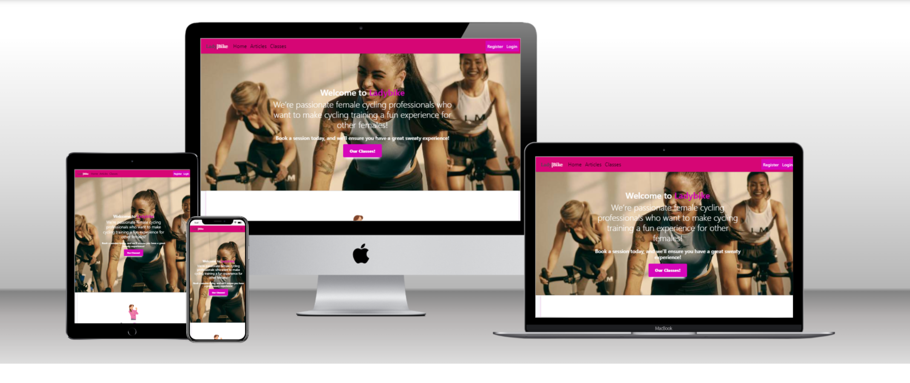
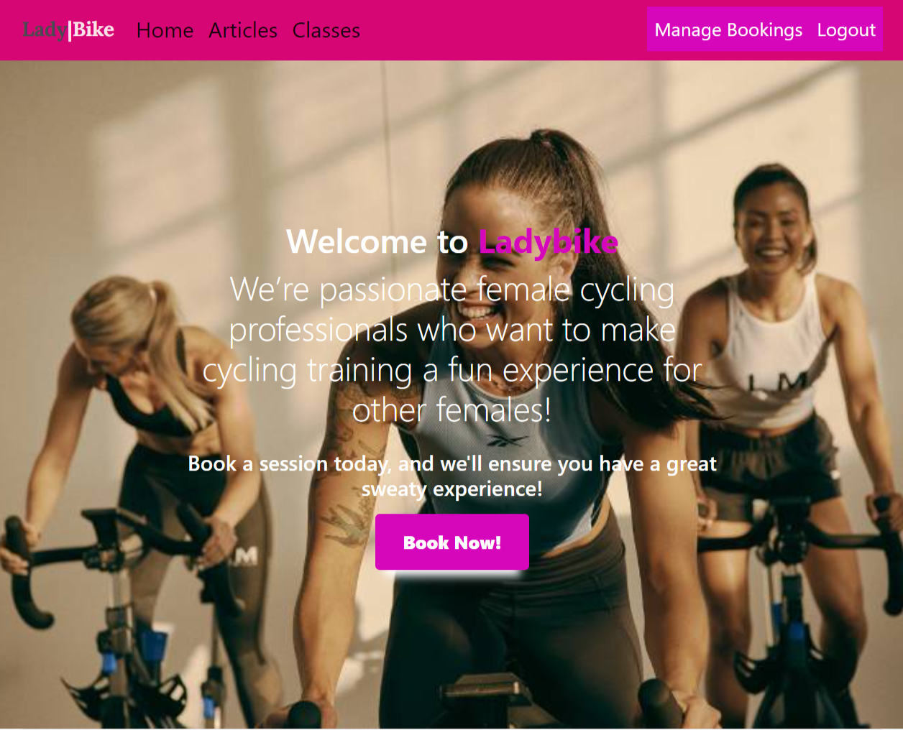
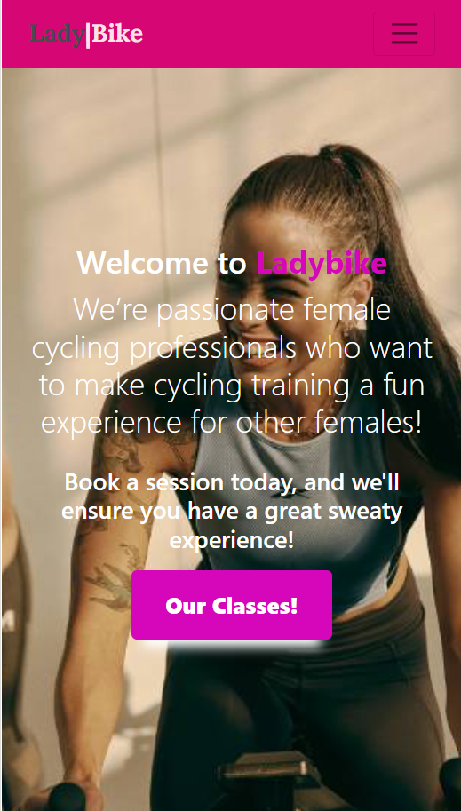
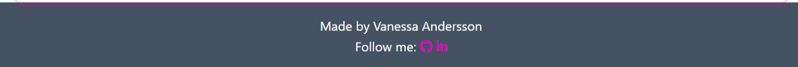
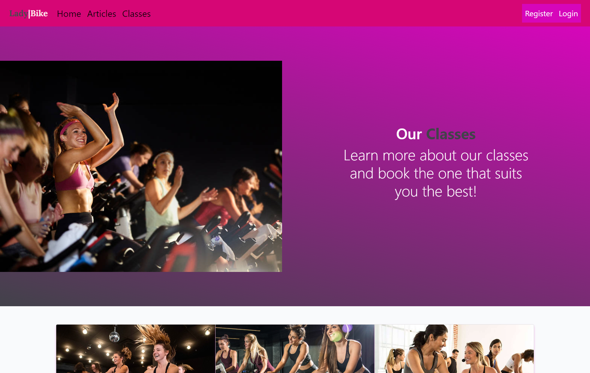
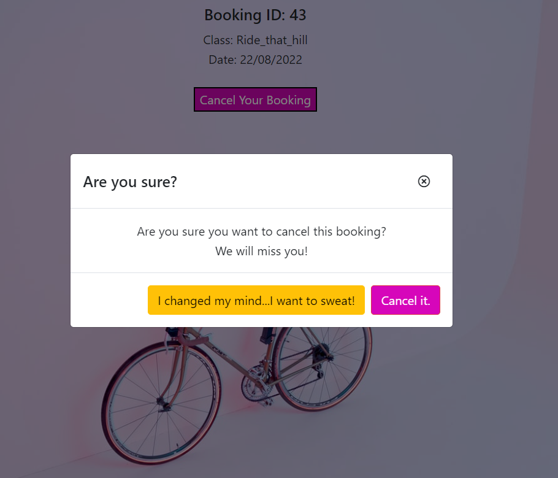
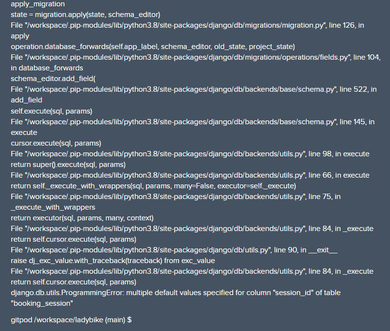
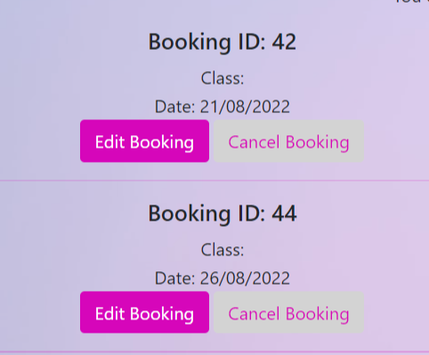

# LadyBike Booking Cycling Platform



[Live application can be found here](https://ladybike.herokuapp.com/home)

This full-stack framework project was built using Django, PostgreSQL, Python, HTML, CSS and JavaScript. This is a cycling booking website designed to display cycling classes to customers and allow them to make/edit/delete bookings. The website also provides a list of articles users can choose to read from and can like if logged in. This project has been built for educational purposes.

---

## UX

LadyBike is a cycling booking platform only for women. It provides three biking classes, and articles focused on a healthy lifestyle and cycling tips. It is designed in light and dark-coloured style, using fuchsia and dark light grey colours. The user is given plenty of choices on how to get to the booking form from the home page - via the navbar and a call to action button.

Users can log in with their credentials to make a booking and like the articles. 

### Strategy
Using the core UX principles in design thinking a pesona profile was created by using Code Institutes template and you can find it [HERE](README_docs/UX/Design_Thinking_Persona_template_Project4_Ladybike.pdf)

This website will offer all of these things listed in the Persona template whilst also allowing for intuitive navigation and comfortability of use.

Due to the age group of female users, it is assumed that most users will be viewing the site on their mobile phones; therefore, creating something responsive is integral to the design. Thus, Bootstrap grids and elements & custom CSS have been used to allow this.

---
## Purpose

The app is designed as a booking application that encourages the users to make a booking.

---
## User Stories

### User Stories that have been satisfied by creation of particular apps in ths project:

| id  |  Content | How was it satisfied
| ------ | ------ | ------ |
|  [#1](https://github.com/van-essa/ladybike/issues/1) | As a user, I can read the page so that I can get more information about Ladybike and the team. | Webpage |
|  [#2](https://github.com/van-essa/ladybike/issues/2) | As a user, I can click on the navbar so that I land on the page I am interested in. | Webpage |
|  [#3](https://github.com/van-essa/ladybike/issues/3) | As a user, I can read more about the classes so that I can book the ones I like the most. | Cycling Classes |
|  [#4](https://github.com/van-essa/ladybike/issues/4) | As a user, I can choose the date of booking so that I can book the cycling class on the date I want. | Booking |
|  [#5](https://github.com/van-essa/ladybike/issues/5) | As a user, I can check the start time of the class so that I can organize my schedule accordingly. |Cycling Classes |
|  [#6](https://github.com/van-essa/ladybike/issues/6) | As a user, I can check the availability of the class so that I know if it is fully-booked. | Booking |
|  [#7](https://github.com/van-essa/ladybike/issues/7) | As a user, I can cancel my booking so that I can join the class when I will be available. | Booking |
|  [#9](https://github.com/van-essa/ladybike/issues/9) | As a user, I can read the articles so that I can learn more about training tips, and healthy recipes. | Articles |
|  [#11](https://github.com/van-essa/ladybike/issues/11) | As a user, I can like the article so that I can can show my appreciation. |  Articles |
|  [#12](https://github.com/van-essa/ladybike/issues/12) | As a user, I can fill in my information so that I can get access to the bookings and like the articles. |  User |
|  [#13](https://github.com/van-essa/ladybike/issues/13) | As an admin, I can manage the articles so that I can share them on my webpage. |  Admin |
|  [#14](https://github.com/van-essa/ladybike/issues/14) | As an admin, I can create drafts so that I can work on the articles later on when I have the time. | Admin |
|  [#21](https://github.com/van-essa/ladybike/issues/21) | As an admin, I can manage the booking on the backend so that I can approve the bookings. |  Admin |
|  [#22](https://github.com/van-essa/ladybike/issues/22) | As a user, I can edit my booking so that I can join the class when I will be available. | Booking |
|  [#23](https://github.com/van-essa/ladybike/issues/23) | As a user, I can create a booking so that I can book a class. | Booking |

### User stories that are planned for next sprint

| id  |  Content | 
| ------ | ------ |
|  [#20](https://github.com/van-essa/ladybike/issues/20) | As a user, I can login with my social accounts so that I can get a smoother user experience. |
|  [#19](https://github.com/van-essa/ladybike/issues/19) | As a user, I can share the articles on my Social Media accounts so that I can share it on my accounts. |
|  [#18](https://github.com/van-essa/ladybike/issues/18) | As a user, I can comment on the articles so I can share my thoughts. |
|  [#17](https://github.com/van-essa/ladybike/issues/17) | As a user, I can contact LadyBike via a contact form so that I can ask my questions. |
|  [#16](https://github.com/van-essa/ladybike/issues/16) | As a user, I can choose different timeslots so that I can book the class according to my availability. |
|  [#15](https://github.com/van-essa/ladybike/issues/15) | As a user, I can choose more than three biking classes so that I can have more class options. |
|  [#8](https://github.com/van-essa/ladybike/issues/8) | As a user, I can add the class to my calendar so that I can can have it in my schedule. |
|  [#10](https://github.com/van-essa/ladybike/issues/10) | As a user, I can choose the order of the published date so that I can read the latest or oldest article. |

---

## Agile Methodology

### Canban board and issues


Github issues were used to create the User stories and group them according to MoSCoW prioritization technique. Link to the project with live issues can be found [HERE](https://github.com/van-essa/ladybike/projects/1). The issues are currently in two categories - done or for the next release.

---

## Scope
In order to achieve the desired user & business goals, the following features will be included in this release:

- Responsive navbar that will navigate to the various pages throughout the site
- Landing page with brief information about the cycling platform and links to the booking page
-Articles page, with cycling, healthy food and lifestyle content
-Article detail page, where logged-in users can like the article
- Classes page, with links to booking
- Booking page, with a booking form to enquire with the cycling gym
- Manage booking page, where logged-in users can edit/delete existing bookings they have
- Register/login feature using Django allauth

---

## Structure
This website has been designed with simplicity in mind, and each page only has vital information so the user can find what they want quickly without having to read through unnecessary things. Each key feature has been separated to highlight its functionality to the user.

The website is made of three apps:

1. Website - Core functionality
2. Articles - Articles display
3. Booking - Booking enquiries

### Databases

The articles and booking app required databases to store information, so four custom models have been created.

#### Articles
Post is the model name for the Articles app, a standalone model that provide all of the information required to display the article's content as part of the cycling platform. Each article has a title, slug, author, featured image, excerpt, date, content and likes.

#### Booking
There are three models in this app, Customer, ClassName & Booking. Combining these three models allows for customer details to be stored, booking enquiries to be made & managed & also enables availability checks whilst the user is enquiring. 

For each booking, there will be a customer & class name assigned to it. They are assigned during the enquiry process. This works for users that are logged in. Logged-in users will have their details associated with the user email address as this is how they are located in the customer model.

The classes model is also used to determine the classes' availability. This logic prevents bookings from being made if no classes are available at the specified date and time.

Entity Relationship Diagram below to see how the models relate to each other:


### Skeleton
[Wireframes can be viewed here](README_docs/Wireframes/LadyBike_Wireframes.pdf)

Please note that the actual website differs slightly from the original wireframes. 

The theme of simplicity follows through to the design, where bootstrap columns and rows have been used. The aim was to divide the pages to keep the same layout throughout so the user could feel more easily on the various pages.

### Surface
The colour palette chosen for this website was fuchsia, grey and white. The colour palette aimed to create a playful and firm feel. Based on fuchsia colours, LadyBike kept the feeling of a robust virtual environment, while white kept the minimal and clean design. An essential mix to share is that this is a female cycling platform. Grey colour also comes in to break the monotony of only the two colours. 


The fonts chosen for this project are 'Lora' & 'SansSerif', beautifully clean and clear fonts for the headings and the available content as it is easier to read for the user. When LadyBike was referred to, `brand-text` was used for most instances.

---

## Features

### Home page
**Navigation bar**: The navigation bar has links to all the active pages for the user and is clearly labelled, the classes option has its page called Our Classes providing information for each of them, and a link to take the user to the Booking system. The Articles are also included in the navbar, where the user can look at the content and read in detail the article they want.

If the user is logged in, then the right side of the menu shows links for pages that only authorised users can visit & use; they are: 'Manage Reservations' & 'Logout'. Otherwise, the user will be given the option to 'Register' or 'Login'. This change in the menu ensures users are directed to pages they can use, preventing any frustration and prompting them to sign up for an account. Furthermore, it makes it abundantly clear what the logged-in status is to the user.

Also, if the user is logged in, the CTA on the header of the front page is linked to the booking page.  Otherwise, the CTA is linking the unlogged user to the classes page




The navigation bar is fully responsive and collapses on mobile screens to a hamburger icon, this easily allows the user to continue to use the navigation links without the need to press back on the browser. 




**Home**: The user gets the information on the home page to understand that this is a cycling booking platform only for women. Then the trainers' profile is followed to provide a professional background. The front page aims to create a welcoming atmosphere for the user and a clear message to the target audience. Also a link to book a class is provided on the header of the page.


**Footer**: The footer displays the name of the project creator and her social links.



### Articles
**Articles**: The user can look at six articles per page and click on the one they want to read. If the user is logged in, they can like the article.


### Classes
**Our Classes**: On the 'Our Classes' page, the user can learn more about each class and click on the call to action 'Book' to link to the booking system and book the class they want if they are logged in. If the user is not logged in, an alert message will be shown reminding them that they must log in to make a booking.



If user is not logged in


If user is logged in


The user can also look at Ladybike's address and contact info for customer support.


### Booking
**Booking form**: This page consists of the customer & booking model forms; they are displayed together to appear as one to make it simple for the user.

In order to make a booking, the user must either register or log in.


Also, noteworthy to mention that the user can logout whnenever they want.


**Manage Booking**: Logged-in users can view the 'manage bookings' page; they are shown any booking enquiries on this page. The aim was to show only the bookings made by the user, but it did not manage to solve this bug issue. Thus all the bookings created are displayed.

The booking ID is displayed at the top of the booking item so they can be easily identified.

There are also edit & delete buttons; users can edit or delete existing bookings they have created. 


Bookings with a date in the past would not be displayed, so the user would not be able to edit or delete them, which could confuse the user and the admin user.

**Edit Booking**: This page displays the booking form pre-populated using the booking instance; the user can change the class and the date in the form. After resubmitting, the user is redirected to the 'Manage booking' page, and a success message is displayed showing which booking was edited. 


**Delete Booking**: This page displays the booking selected with all of its information, the user presses 'Cancel Booking', and a modal pop is up for the user to confirm the cancellation, explaining that this cannot be undone. If the user chooses 'Cancel', the booking will be deleted from the model. After confirming, the user is redirected to the 'Manage Bookings' page, and a success message shows which reservation was edited.




---
## Technologies Used

Several technologies have been used to enable this design to work:

| Technology  |  Content | 
| ------ | ------ |
|  [Django](https://www.djangoproject.com/) |Django is the framework that has been used to build the over project and its apps. |
|  [Python](https://www.python.org/) | Python is the core programming language used to write all of the code in this application to make it fully functional. |
|  [Bootstrap](https://getbootstrap.com/) | Used for creating responsive design. |
|  [Google Fonts](https://fonts.google.com/) | Used to obtain the fonts linked in the header, fonts used were Lora and Sans Serrif |
|  [Font Awesome](https://fontawesome.com/) | Used to obtain the icons used on the high scores and rules pages. |
|  [Google Developer Tools](https://developers.google.com/web/tools/chrome-devtools) | Used as a primary method of fixing spacing issues, finding bugs, and testing responsiveness across the project. |
|  [GitHub](https://github.com/) | Used as the development environment. |
|  [Heroku](https://dashboard.heroku.com/apps) | Used to deploy my application. |
|  [Lucid](https://lucid.app/documents#/dashboard) | Used to create the ERD for the project. |
|  [Grammarly](https://www.grammarly.com/) | Used to fix the grammar errors across the project. |
|  [Canva](https://www.canva.com/) | Used to create the animated images in the front page and rezise some of the pictures used in the project. |
|  [Pep8](http://pep8online.com/) | Used to test my code for any issues or errors. |
|  [Unicorn Revealer](https://chrome.google.com/webstore/detail/unicorn-revealer/lmlkphhdlngaicolpmaakfmhplagoaln?hl=en-GB) | Used to detect overflow of elements, which allowed me to quickly debug any issues. |
|  [Coloors](https://coolors.co/) | Used to create a colour palette for the design. |
|  [Cloudinary](https://cloudinary.com/) | Used to store all of my static files and images. |
|  [W3C Markup Validation Service](https://validator.w3.org/) | Used to validate all HTML code written and used in this website. |
|  [W3C CSS Validation Service](https://jigsaw.w3.org/css-validator/#validate_by_input) | Used to validate all CSS code written and used in this website. |
|  [JSHint](https://jshint.com/) | Used to validate JS code written and used in this website. |
|  [Freeformatter CSS Beautify](https://www.freeformatter.com/css-beautifier.html) | Used to accurately format the CSS code. |
|  [Freeformatter HTML Formatter](https://www.freeformatter.com/html-formatter.html) | Used to accurately format the HTML code. |
|  [Techsini](https://techsini.com/) | Used to generate responsive image used in README file. |
|  [Lighthouse](https://web.dev/measure/?gclid=Cj0KCQjwrs2XBhDjARIsAHVymmRXL8fiu8EoDLD_EPvDwuEmmeW-QbKgjm808ohCKPRL0tVnRJV4sMEaAkSUEALw_wcB) | Used to test the accessibility of the website. |
|  [Animate](https://animate.style/) | Used to animate forms. |
|  [PostgreSQL](https://www.postgresql.org/) | Used to animate forms. | Two Heroku PostgresSQL were created. One for Testing usage and the other for storing the data for the models. |

---
## Testing
A combination of manual and automated testing has been used to ensure that the website's functionality meets the desired intent.

### Code Validation
All code has been validated using an online validator specific to the language; all code now passes with zero errors, except one in the index.html page where `the element button must not appear as a descendant of the element.` The error was not fixed and will be mentioned in the bugs below since removing the class from the button element caused a different appearance. 

- [W3C Markup Validation Service](https://validator.w3.org/) 
    - Used to validate all HTML code written and used in this webpage.


- [W3C CSS Validation Service](https://jigsaw.w3.org/css-validator/#validate_by_input)
    - Used to validate all CSS code written and used in this webpage.


- [JSHint](https://jshint.com/)
    - Used to validate JS code

- [Pep8](http://pep8online.com/)
    - Used to test my code for any issues or errors.

- [Lighthouse](https://web.dev/measure/?gclid=Cj0KCQjwrs2XBhDjARIsAHVymmRXL8fiu8EoDLD_EPvDwuEmmeW-QbKgjm808ohCKPRL0tVnRJV4sMEaAkSUEALw_wcB/)
    - Used to test the accessibility of the website.


### Manual Testing

This project has been tested manually by the creator, Vanessa Andersson, and have also asked to had it peer-reviewed & tested by friends and family on multiple devices and screen sizes.

[TESTING](README_docs/Testing/Testing.pdf)

### Automated Testing

Coverage library has been used throughout testing to keep track how much of Python code was covered by the tests written. From running the coverage report the website has 81% of the code tested. The remaining code is covered by manual testing. You can look at the report [HERE](README_docs/Testing/Testing_Coverage.png)

To generate your own coverage report from the command line:

1. Install the package using `pip3 install coverage`
2. Run `coverage run manage.py test`
3. Then `coverage html` to generate the report
4. You can view the report in a browser by using the command `python3 -m http.server` and opening the `index.html` file from inside the `htmlcov` folder.

---
## Bugs and Fixes

### Fixed Bugs
**_Database Issue_**

A problem occurred when a change was created in the Booking Models.


The first step was to run the following:
- `python3 manage.py makemigrations --dry-run`
- `python3 manage.py makemigrations`
- `python3 manage.py migrate --plan`
- `python3 manage.py migrate`

But that did not solve the issue:



Then I tried to add 1 instead of True on the seats default session, but it did not help solve the issue. Thus a clean state needed to be craeted to rerun the commands. The steps followed were:
1. Remove all migrations files within the project. Go through Articles and Booking migration folders and remove everything inside, except the __init__.py file, whis it is essential **not** to remove this.
2. Go to the Heroku app dashboard and find Resources, then click Heroku PostGres:


3. Then in data.heroku, go to Settings


4. Click on Reset Database, type the app name, namely Ladybike in the prompted box and press Reset Database


5. After resetting, if there is a new DATABASE_URL, it should be in the Heroku config vars, copy paste that and paste it into the env.py file.
6. When that is done, run migrations to create the tables on the database
- `python3 manage.py makemigrations --dry-run`
- `python3 manage.py makemigrations`
- `python3 manage.py migrate --plan`
- `python3 manage.py migrate`
- `python3 manage.py createsuperuser`
7. Then:
- `heroku login -i`
- `heroku run python3 manage.py migrate`
- `heroku run python3 manage.py createsuperuser`

Which worked to solve the issue.

**_Credentials on Heroku Database_**

When running pytho3 manage.py runserver, this error popped up.


The error occurred because the credentials for Ladybike's Heroku database have been rotated. This happens when Heroku performs database maintenance on their servers. The DATABASE_URL var in the Heroku app config vars will update automatically with the new Postgres URI, but you'll need to update your env.py file locally. Thus, the env.py file was updated with the new Postgress URI, and the error disappeared.

**_No action when Registering_**

When testing to register, no action occurred. Namely, the user did not log in. It was just redirecting the user to the login page. Then, looking closer at the terminal, the result was that the user was registered through the Social account, which was decided not to be implemented in the application. Yet, it was mentioned on the Registration HTML file (signup.html).


Thus, the solution was the replacement from socialaccount_signup to account_signup; namely:
`<form role="form" class="signup" id="signup_form" method="post" action="">`


instead of


`<form role="form" class="signup" id="signup_form" method="post" action="">`

**_Nothing shown on Manage Bookings_**

When Testing Manage Bookings, the user could not see anything even though they had made a booking. The problem with this issue occurred because the booking was printed instead of returned on the Booking Views file.


Namely it should be `return get_booking`

**_Our Classes page not responsive_**

The 'Our Classes' page was not responsive on smaller devices with regards to the initial card Bootstrap setting of each class:


Thus a group-card class was chosen instead, so the cards are aligned and mobile-friendly.

### Unfixed Bugs
**_Google Maps not responsive_**

Google Maps was featured under the contact information of Ladybike at the end of the 'Our Classes' page but did not respond on smaller screens even though a JS code was implemented. Also, a CSS code was tested, but neither one worked. Thus, Google Maps was removed from the page.


**_Class name do not appear on Manage Bookings Page_**

The class name does not appear on the Manage Bookings page even though it is called on the manage_booking.html file the same way it is on the edit_booking.html and delete_booking.html files. A scan on the Bookings views.py and the manage_booking.html files occurred with no luck in debugging this issue.




---
## Deployment

The master branch of this repository has been used for the deployed version of this application.

### Using Github & Gitpod

To deploy my Django application, I had to use the [Code Institute Full Template](https://github.com/Code-Institute-Org/gitpod-full-template).

- Click the `Use This Template` button.
- Add a repository name and brief description.
- Click the `Create Repository from Template` to create your repository.
- To create a Gitpod workspace you then need to click `Gitpod`, this can take a few minutes.
- When you want to work on the project it is best to open the workspace from Gitpod (rather than Github) as this will open your previous workspace rather than creating a new one. You should pin the workspace so that it isn't deleted.
-  Committing your work should be done often and should have clear/explanatory messages, use the following commands to make your commits:
    - `git add .`: adds all modified files to a staging area
    - `git commit -m "A message explaining your commit"`: commits all changes to a local repository.
    - `git push`: pushes all your committed changes to your Github repository.

### Forking the GitHub Repository

By forking the GitHub Repository you will be able to make a copy of the original repository on your own GitHub account allowing you to view and/or make changes without affecting the original repository by using the following steps:

1. Log in to GitHub and locate the [GitHub Repository](repo here???)
2. At the top of the Repository (not top of page) just above the "Settings" button on the menu, locate the "Fork" button.
3. You should now have a copy of the original repository in your GitHub account.

### Making a Local Clone

1. Log in to GitHub and locate the [GitHub Repository](repo here???)
2. Under the repository name, click "Clone or download".
3. To clone the repository using HTTPS, under "Clone with HTTPS", copy the link.
4. Open commandline interface on your computer
5. Change the current working directory to the location where you want the cloned directory to be made.
6. Type `git clone`, and then paste the URL you copied in Step 3.

```
$ git clone http..repo here???
```

7. Press Enter. Your local clone will be created.

### Deployment to heroku

**In your app** 

1. add the list of requirements by writing in the terminal "pip3 freeze --local > requirements.txt"
2. Git add and git commit the changes made

**Log into heroku**

3. Log into [Heroku](https://dashboard.heroku.com/apps) or create a new account and log in

4. top right-hand corner click "New" and choose the option Create new app, if you are a new user, the "Create new app" button will appear in the middle of the screen

5. Write app name - it has to be unique, it cannot be the same as this app
6. Choose Region - I am in Europe
7. Click "Create App"

**The page of your project opens.**

8. Go to Resources Tab, Add-ons, search and add Heroku Postgres

9. Choose "settings" from the menu on the top of the page

10. Go to section "Config Vars" and click button "Reveal Config Vars". 

11. Add the below variables to the list

    * Database URL will be added automaticaly
    * Secret_key - is the djnago secret key can be generated [here](https://miniwebtool.com/django-secret-key-generator/). 


**Go back to your code**

12. Procfile needs to be created in your app
```
web: gunicorn PROJ_NAME.wsgi
```

13. In settings in your app add Heroku to ALLOWED_HOSTS

14. Add and commit the changes in your code and push to github

**Final step - deployment**

15. Next go to "Deploy" in the menu bar on the top 

16. Go to section "deployment method", choose "GitHub"

17. New section will appear "Connect to GitHub" - Search for the repository to connect to

18. type the name of your repository and click "search"

19. once Heroku finds your repository - click "connect"

20. Scroll down to the section "Automatic Deploys"

21. Click "Enable automatic deploys" or choose "Deploy branch" and manually deploy

22. Click "Deploy branch"

Once the program runs:
you should see the message "the app was sussesfully deployed"

23. Click the button "View"

The live link can be found [here](live/page/here/???)

---
## Credits

Throughout the process of building this website, various online sources have been used to help fix bugs & tackle problems, in addition to multiple modules to create the functionality of this website:

### Online resources
* [Icons8](https://icons8.com/)
* [Unsplash](https://unsplash.com/)
* [Fontawsome](https://fontawesome.com/)
* [Bootstrap 5]()
* [Crispy Forms](https://django-crispy-forms.readthedocs.io/en/latest/)
* [Django Allauth](https://django-allauth.readthedocs.io/en/latest/installation.html)
* [Queryset Display](https://stackoverflow.com/questions/48872380/display-multiple-queryset-in-list-view)
* [Updating form](https://stackoverflow.com/questions/42217334/django-get-data-and-edit-in-the-same-form-edit-in-one-place)
* [Markdown best practices](https://www.markdownguide.org/basic-syntax/)
* [Appseed Templates](https://appseed.us/generator/material-kit/)
* [Debounce](https://davidwalsh.name/javascript-debounce-function)

### Tutorials and inspiration

* The walkthrough project 'I Think Therefore I Blog' from Code Institute [videos](https://learn.codeinstitute.net/courses/course-v1:CodeInstitute+FST101+2021_T1/courseware/b31493372e764469823578613d11036b/fe4299adcd6743328183aab4e7ec5d13/).
* My favourite webpage as inspiration [SWEAT](https://www.sweat.com/)
* Card template from [bootstrap examples](https://getbootstrap.com/docs/4.4/components/card/)
* Testing YouTube tutorial for my automated testing [Testing](https://www.youtube.com/playlist?list=PLbpAWbHbi5rMF2j5n6imm0enrSD9eQUaM)
* Code Validation with Joanna Gorska [Code Validation](https://www.youtube.com/watch?v=6j9dZTW4owI&ab_channel=CodeInstitute)

### People

- Harry Dhillon - my mentor from Code Institute
- Cristian Deri - for testing the app extensively
- Robert Andersson - for testing the app extensively
- The team at Tutor Support at Code Institure - for helping me with my bugs
- My classmates - for helping me when asked for help on Slack